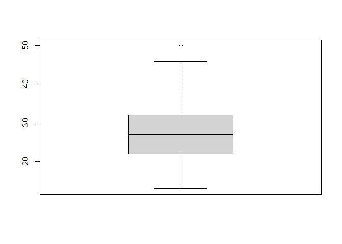
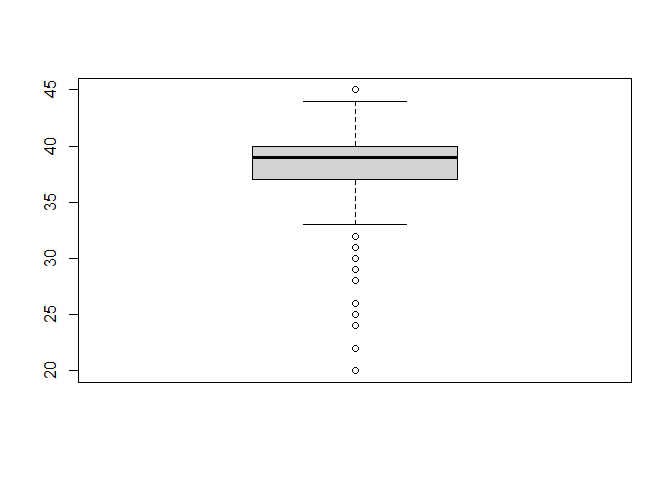
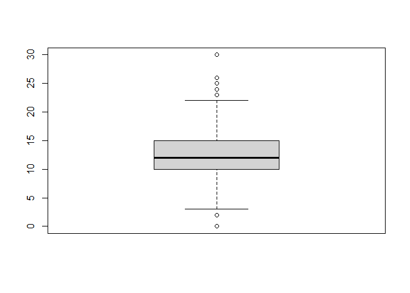
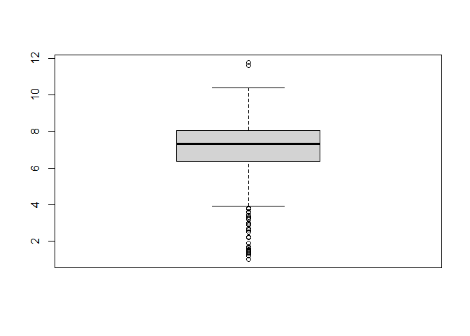
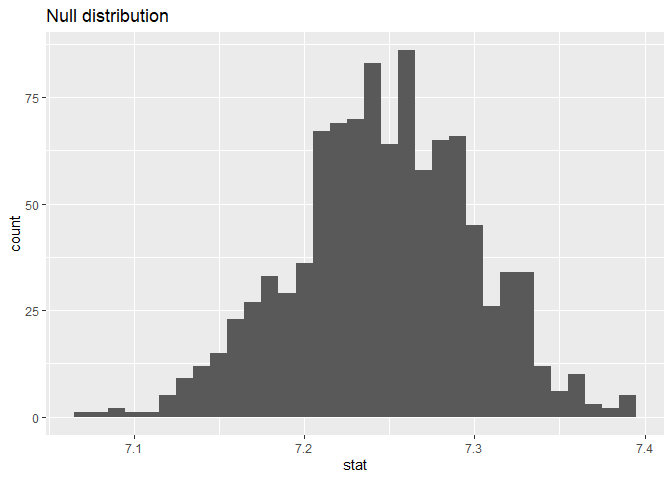
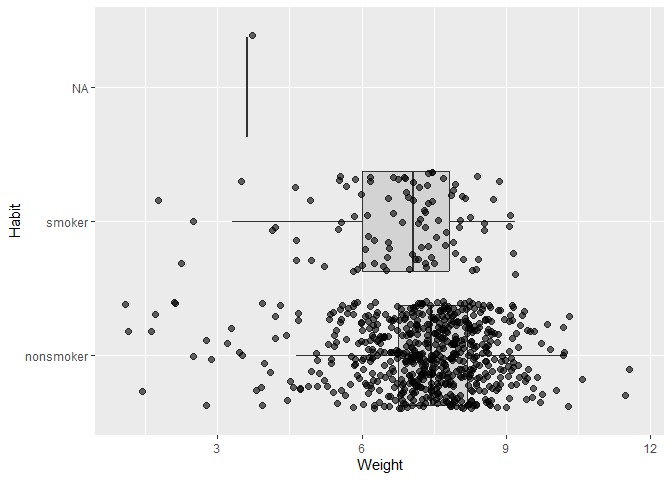

Lab 12 - Smoking during pregnancy
================
Hannah Crawley
4/10/2025

### Load packages and data

``` r
library(tidyverse) 
library(tidymodels)
```

    ## Warning: package 'tidymodels' was built under R version 4.4.3

    ## Warning: package 'dials' was built under R version 4.4.3

    ## Warning: package 'infer' was built under R version 4.4.3

    ## Warning: package 'modeldata' was built under R version 4.4.3

    ## Warning: package 'parsnip' was built under R version 4.4.3

    ## Warning: package 'recipes' was built under R version 4.4.3

    ## Warning: package 'rsample' was built under R version 4.4.3

    ## Warning: package 'tune' was built under R version 4.4.3

    ## Warning: package 'workflows' was built under R version 4.4.3

    ## Warning: package 'workflowsets' was built under R version 4.4.3

    ## Warning: package 'yardstick' was built under R version 4.4.3

``` r
library(dplyr)
library(openintro)
```

    ## Warning: package 'openintro' was built under R version 4.4.3

    ## Warning: package 'airports' was built under R version 4.4.3

    ## Warning: package 'cherryblossom' was built under R version 4.4.3

    ## Warning: package 'usdata' was built under R version 4.4.3

``` r
data("ncbirths")
```

``` r
boxplot(ncbirths$fage)
```

<!-- -->

``` r
boxplot(ncbirths$mage)
```

<!-- -->

``` r
boxplot(ncbirths$weeks)
```

<!-- -->

``` r
boxplot(ncbirths$visits)
```

<!-- -->

``` r
boxplot(ncbirths$weight)
```

<!-- -->

``` r
Q1 <- quantile(ncbirths$weight, 0.25)
Q3 <- quantile(ncbirths$weight, 0.75)
IQR <- Q3 - Q1

ncbirths_outliers <- ncbirths %>%
  filter(weight < (Q1 - 1.5 * IQR) | weight > (Q3 + 1.5 * IQR))
```

``` r
summary(ncbirths_outliers)
```

    ##       fage            mage               mature       weeks      
    ##  Min.   :16.00   Min.   :16.00   mature mom : 7   Min.   :20.00  
    ##  1st Qu.:25.00   1st Qu.:22.00   younger mom:33   1st Qu.:26.00  
    ##  Median :30.50   Median :28.00                    Median :29.00  
    ##  Mean   :29.43   Mean   :27.65                    Mean   :29.33  
    ##  3rd Qu.:34.00   3rd Qu.:32.00                    3rd Qu.:32.00  
    ##  Max.   :42.00   Max.   :41.00                    Max.   :43.00  
    ##  NA's   :10                                       NA's   :1      
    ##        premie       visits              marital       gained     
    ##  full term: 3   Min.   : 4.000   not married:22   Min.   : 0.00  
    ##  premie   :36   1st Qu.: 6.000   married    :17   1st Qu.:13.75  
    ##  NA's     : 1   Median :10.000   NA's       : 1   Median :25.00  
    ##                 Mean   : 9.514                    Mean   :24.86  
    ##                 3rd Qu.:11.000                    3rd Qu.:35.25  
    ##                 Max.   :20.000                    Max.   :60.00  
    ##                 NA's   :3                         NA's   :4      
    ##      weight       lowbirthweight    gender         habit         whitemom 
    ##  Min.   : 1.000   low    :38     female:21   nonsmoker:35   not white:15  
    ##  1st Qu.: 1.500   not low: 2     male  :19   smoker   : 4   white    :25  
    ##  Median : 2.565                              NA's     : 1                 
    ##  Mean   : 2.836                                                           
    ##  3rd Qu.: 3.265                                                           
    ##  Max.   :11.750                                                           
    ## 

## Part 1: Baby Weights

### Exercise 1

> What are the cases in this data set? How many cases are there in our
> sample?

There are 1000 observations (each observation is one mother/pregnancy)
and 13 variables

### Exercise 2

> Create a filtered data frame called ncbirths_white that contains data
> only from White mothers. Then, calculate the mean of the weights of
> their babies.

``` r
ncbirths_white <- ncbirths %>%
  filter(whitemom == "white") 
```

``` r
ncbirths_notwhite <- ncbirths %>%
  filter(whitemom == "not white") 
```

``` r
mean(ncbirths_white$weight)
```

    ## [1] 7.250462

``` r
mean(ncbirths_notwhite$weight)
```

    ## [1] 6.719542

### Exercise 3

> Are the criteria necessary for conducting simulation-based inference
> satisfied? Explain your reasoning.

Independent obsevations - each observation reflects one mother

### Exercise 4

> Run the appropriate hypothesis test, visualize the null distribution,
> calculate the p-value, and interpret the results in the context of the
> data and the hypothesis test.

Null - baby weight = 7.43 Alternative - weight does not = 7.43

``` r
boot_dist <- ncbirths_white %>%
  specify(response = weight) %>%
  generate(reps = 1000, type = "bootstrap") %>%
  calculate(stat = "mean")
```

``` r
ggplot(boot_dist, aes(x = stat)) +
  geom_histogram(binwidth = 0.01) +
  labs(title = "Null distribution")
```

<!-- -->

``` r
get_p_value(boot_dist, obs_stat = 7.43, direction = "two-sided")
```

    ## Warning: Please be cautious in reporting a p-value of 0. This result is an approximation
    ## based on the number of `reps` chosen in the `generate()` step.
    ## ℹ See `get_p_value()` (`?infer::get_p_value()`) for more information.

    ## # A tibble: 1 × 1
    ##   p_value
    ##     <dbl>
    ## 1       0

``` r
t.test(ncbirths_white$weight, mu = 7.43)
```

    ## 
    ##  One Sample t-test
    ## 
    ## data:  ncbirths_white$weight
    ## t = -3.3472, df = 713, p-value = 0.0008593
    ## alternative hypothesis: true mean is not equal to 7.43
    ## 95 percent confidence interval:
    ##  7.145153 7.355771
    ## sample estimates:
    ## mean of x 
    ##  7.250462

The mean of the current sample is 7.25 as compared to the 7.43 reported
in 1995 – the t-test is significant (p = 0.0009) suggesting there is a
sig difference between the means. We can infer that the average weight
of babies has changed since 1995.

## Part 2: Baby weight vs smoking

### Exercise 5

> Make side-by-side box plots displaying the relationship between habit
> and weight. What does the plot highlight about the relationship
> between these two variables?

``` r
ggplot(ncbirths_white, aes(x = weight, y = habit)) +
  geom_boxplot(outlier.shape = NA, fill = "lightgray") +
  geom_jitter(width = 0.2, size = 2, alpha = 0.6, color = "black") +
  labs(x = "Weight", y = "Habit") 
```

<!-- --> From these
box plots - non smokers’ babies tend to have higher birth weights on
average than smokers’ babies suggesting there is a potential neg effect
of smoking on birth weight (for white mothers)

### Exercise 6

> Before continuing, create a cleaned version of the dataset by removing
> any rows with missing values for habit or weight. Name this version
> ncbirths_clean.

``` r
ncbirths_clean <- ncbirths %>%
  filter(!is.na (weight) & !is.na(habit)) 
```

### Exercise 7

> Calculate the observed difference in means between the baby weights of
> smoking and non-smoking mothers.

``` r
ncbirths_clean %>%
  group_by(habit) %>%
  summarize(mean_weight = mean(weight))
```

    ## # A tibble: 2 × 2
    ##   habit     mean_weight
    ##   <fct>           <dbl>
    ## 1 nonsmoker        7.14
    ## 2 smoker           6.83

Smokers’ babies appear to have lower birth weights on average

### Exercise 8

> Write the hypotheses for testing if the average weights of babies born
> to smoking and non-smoking mothers are different.

H0: mean birth weight of the babies born to non-smoking and smoking
mothers do not significantly differ (μ1 = μ2)

HA: mean birth weight of babies born to non-smoking and smoking mothers
do sig differ (μ1 ≠ μ2)

### Exercise 9

> Run the appropriate hypothesis test, calculate the p-value, and
> interpret the results in context of the data and the hypothesis test.

``` r
t.test(weight ~ habit, data = ncbirths_clean)
```

    ## 
    ##  Welch Two Sample t-test
    ## 
    ## data:  weight by habit
    ## t = 2.359, df = 171.32, p-value = 0.01945
    ## alternative hypothesis: true difference in means between group nonsmoker and group smoker is not equal to 0
    ## 95 percent confidence interval:
    ##  0.05151165 0.57957328
    ## sample estimates:
    ## mean in group nonsmoker    mean in group smoker 
    ##                7.144273                6.828730

There is a significant difference (p = 0.019) between the two groups
suggesting that on average babies born to smokers have significantly
lower birth weight

### Exercise 10

> Construct a 95% confidence interval for the difference between the
> average weights of babies born to smoking and non-smoking mothers.

95% confidence interval is roughly 0.052 to 0.580 - meaning that we are
95% sure that the difference between the mean birth weights ranges from
.052 and .580 lbs

## Part 3: Mother’s age vs baby weight

### Exercise 11

> First, a non-inference task: Determine the age cutoff for younger and
> mature mothers. Use a method of your choice, and explain how your
> method works.

Looked at the data sorted by age - based on prior knowledge went to the
30s and above – appears that 35 is the cut off for younger and mature
mothers, as this is typically the age where there are greater
genetic/developmental risks at this age

### Exercise 12

> Conduct a hypothesis test evaluating whether the proportion of low
> birth weight babies is higher for mature mothers. Use  
> α = 0.05. State the hypotheses, Verify the conditions, Run the test
> and calculate the p-value, State your conclusion within context of the
> research question

Null: Mu birth weight for younger mothers = Mu birth weight for mature
mothers Alternative: Mu birth weight for younger mothers does NOT = Mu
birth weight for mature mothers

``` r
ncbirths_clean %>%
  group_by(mature) %>%
  summarize(mean_weight = mean(weight))
```

    ## # A tibble: 2 × 2
    ##   mature      mean_weight
    ##   <fct>             <dbl>
    ## 1 mature mom         7.15
    ## 2 younger mom        7.10

It appears that younger mothers tend to give birth to babies with lower
birth weights

``` r
t.test(weight ~ mature, data = ncbirths_clean)
```

    ## 
    ##  Welch Two Sample t-test
    ## 
    ## data:  weight by mature
    ## t = 0.36265, df = 165.51, p-value = 0.7173
    ## alternative hypothesis: true difference in means between group mature mom and group younger mom is not equal to 0
    ## 95 percent confidence interval:
    ##  -0.2436085  0.3532357
    ## sample estimates:
    ##  mean in group mature mom mean in group younger mom 
    ##                  7.152045                  7.097232

There is not a significant (p = 0.717) difference in average birth
weight for babies born to mothers who are younger compared to those who
are more mature.

### Exercise 13

> Calculate a confidence interval for the difference between the
> proportions of low birth weight babies between mature and younger
> mothers. Interpret the interval in the context of the data and explain
> what it means.

95% confidence interval is roughly -0.24 to 0.35 - meaning that we are
95% sure that the difference between the mean birth weight falls within
that range
